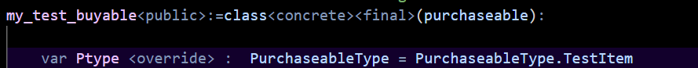

# Project OST 🚀

ProjectOST is a comprehensive kit built in the Verse programming language that emphasizes proper Object-Oriented programming interfaces. It allows users to easily create their own purchasable items, such as computers or any other custom devices, by simply adding one file.

## Table of Contents

- [Installation](#installation)
- [Realeses](https://github.com/Tsaryii/ProjectOST/releases)
- [Additions](#additions)
- [Features](#features)
- [Contributing](#contributing)
- [License](#license)
- [Acknowledgments](#acknowledgments)

## Installation

1. Optional -> Clone the repo
   ```sh
   git clone https://github.com/Tsaryii/ProjectOST.git

OR

1. Create new UEFN / Verse Project
    
2. [Download](https://github.com/Tsaryii/ProjectOST/archive/refs/heads/main.zip) & copy paste 'TycoonStomper' into your project.
    
3. Build verse code and enjoy!
    

## Additions
### - New purchaseable

1. [Watch the video](https://www.youtube.com/watch?v=ojgnbpQiWuU)
    
2. Dont forget to update the Ptype
    
### - Suggest Feature or Bug Fix
1. [Discussion Form](https://github.com/Tsaryii/ProjectOST/discussions/1)

2. Write your suggestions or bug fix! 


## Features

- Uses a large abstract superclass to allow for child classes to be made easily
- Emphasizes proper Object-Oriented programming interfaces
- Easily create custom purchasable items
- Extensible and modular design


## Contributing

Contributions are what make the open-source community such an amazing place to learn, inspire, and create. Any contributions you make are greatly appreciated.

1. Fork the Project
2. Create your Feature Branch (git checkout -b feature/AmazingFeature)
3. Commit your Changes (git commit -m 'Add some AmazingFeature')
4. Push to the Branch (git push origin feature/AmazingFeature)
5. Open a Pull Request


## License
Distributed under the GPL 3.0 License. See LICENSE for more information.

## Acknowledgments
- Left empty (for now)
