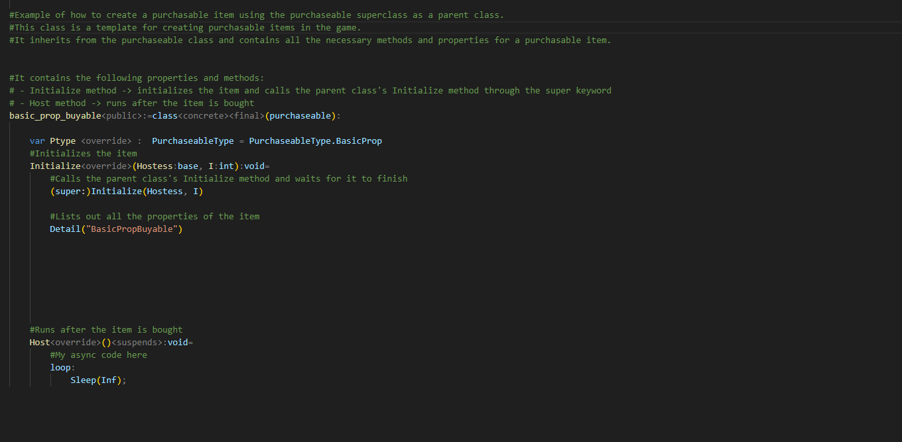
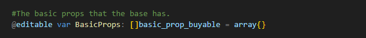
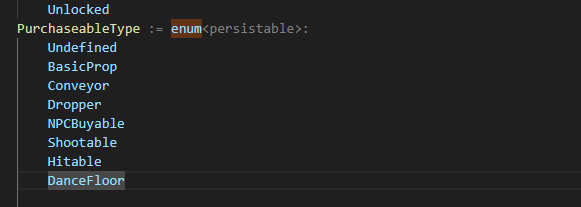
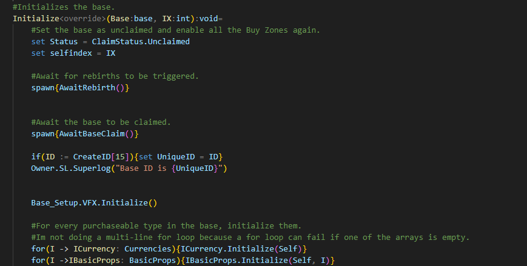
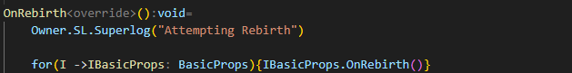

# TycoonKitX 🚀

TycoonKitX is a comprehensive kit built in the Verse programming language that emphasizes proper Object-Oriented programming interfaces. It allows users to easily create their own purchasable items, such as computers or any other custom devices, by simply adding one file.


## Table of Contents

- [Installation](#installation)
- [Additions](#additions)
- [Features](#features)
- [Screenshots](#screenshots)
- [Contributing](#contributing)
- [License](#license)
- [Acknowledgments](#acknowledgments)

## Installation

1. Optional -> Clone the repo
   ```sh
   git clone https://github.com/Tsaryii/TycoonKitX.git

OR

1. Create new UEFN / Verse Project
    
2. Copy paste repo into UEFN / Verse explorer
    

## Additions
Creating a new purchaseable is super easy simply do the following...

1. Create a new file under the purchaseables folder and copy / paste the basic_prop template.
    

2. Add the new purchaseable to the BaseManager.verse
    

3. Create a newpurchasetype enum value
    

4. Ensure the item gets initialized
    

5. If the item needs to handle a rebirth add it to the rebirthable config
    

## Features

Emphasizes proper Object-Oriented programming interfaces
Easily create custom purchasable items
Simple integration by adding a single file
Extensible and modular design

## Contributing

Contributions are what make the open-source community such an amazing place to learn, inspire, and create. Any contributions you make are greatly appreciated.

1. Fork the Project
2. Create your Feature Branch (git checkout -b feature/AmazingFeature)
3. Commit your Changes (git commit -m 'Add some AmazingFeature')
4. Push to the Branch (git push origin feature/AmazingFeature)
5. Open a Pull Request


## License
Distributed under the GPL 3.0 License. See LICENSE for more information.

## Acknowledgments
- Fortnite Docs
- Open Source Community
- FNC Discord