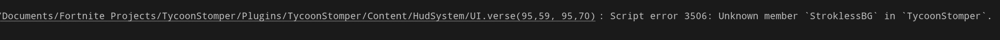

# Project OST 🚀 
[](https://www.youtube.com/watch?v=q2OvY_Gq5Bk&t=405s)
[]([https://discord.gg/R87aPX78Fa](https://discord.gg/R87aPX78Fa))
[](https://github.com/Tsaryii/ProjectOST/releases)
[](LICENSE)

---

### Version: 0.4.0-unstable

Project OST is a comprehensive kit written in **Verse**, emphasizing proper Object-Oriented programming interfaces. It enables developers to create purchasable items (computers, devices, etc.) by simply adding one file—perfect for building advanced user experiences in **UEFN**.

---

## Table of Contents
1. [Support](#support)
2. [Instructional Setup Guide](#instructional-setup-guide)
3. [Wiki](#wiki)
4. [Installation](#installation)
5. [Additions](#additions)
    - [New Purchasable](#-new-purchasable)
    - [Suggest a Feature or Bug Fix](#-suggest-feature-or-bug-fix)
6. [Features](#features)
    - [Planned for 0.4-alpha](#planned-for-04-alpha)
    - [Planned ~1.0-release](#planned-10-release)
7. [Contributing](#contributing)
8. [License](#license)
9. [Acknowledgments](#acknowledgments)

---

## Support
**Need help fast?** Check out our [Support Server](https://discord.gg/R87aPX78Fa)!  

## Instructional Setup Guide
Learn how to set up Project OST in your UEFN level by watching the [YouTube guide](https://www.youtube.com/watch?v=q2OvY_Gq5Bk).

## Wiki
Our [Wiki](https://github.com/Tsaryii/ProjectOST/wiki) is a work in progress, but already has useful pages to help you get started.

---

## Installation

There are two primary ways to install Project OST:

### 1. Manual Clone or Download
1. **Clone the repository** *(optional)*:
   ```bash
   git clone https://github.com/Tsaryii/ProjectOST.git
   ```
2. **Create a new UEFN / Verse project** (if you haven't already).
   > 
3. **Download** the ZIP: [Download Project OST](https://github.com/Tsaryii/ProjectOST/archive/refs/heads/main.zip) and copy the **`TycoonStomper`** folder into your UEFN project.
   > 
4. **Rename** `TycoonStomper__VERSION.X.X` to `TycoonStomper`.
5. **Build your Verse code** and enjoy!

> **Warning**  
>   
> If you see an error about `TycoonStomper.StroklessBG`, rename it to `StroklessBG`.

### 2. Instructional Video
Watch the [step-by-step video](https://www.youtube.com/watch?v=q2OvY_Gq5Bk) for a visual installation walkthrough.

---

## Additions

### - New Purchasable
1. Follow the [step-by-step Video Guide](https://www.youtube.com/watch?v=ojgnbpQiWuU).  
2. Don’t forget to update the Ptype:  
   > 

### - Suggest Feature or Bug Fix
1. Open the [Discussion Form](https://github.com/Tsaryii/ProjectOST/discussions/1)  
2. Write your suggestion or the bug you found!

---

## Features
- **OOP-Friendly:** A large abstract superclass allows you to easily make child classes.  
- **Custom Purchasables:**  
  - Basic Props  
  - Collectables  
  - Conveyors  
  - Dance Floors  
  - Droppers  
  - Gifts  
  - Hitables  
  - MoneyWheel  
  - NPC Spawners  
  - Shootables  
  - Custom Pet System  
- **Persistent Saves:** Verse persistence to save everything between sessions  
- **Rebirth System**  
- **Infinite Custom Currencies** with ID system  
- **Custom UI Config** & settings  
- **Custom XP System**  
- **Hide/Show Props** conditionally  
- **Custom Animations**  
- **Multiple Purchase Styles**  
- **Easy Expansion**  
- **Number Truncation** (e.g., 1.2K, 1.3M)  
- **Toggle Props Visibility** based on money  
- **Audio Integration**  

### Planned for 0.4-alpha
- Better UI system  
- Computers  
- New Dropper system *(in 0.3.6+)*  
- Custom billboard system *(in 0.3.5+)*  
- **Suggest a feature** on our [Discord!](https://discord.gg/R87aPX78Fa)

### Planned ~1.0-release
- Money trading between players  
- Multiple pets at a time  
- Fully functional co-op  
- More purchasables

---

## Contributing
Contributions make the open-source community an amazing place to learn, inspire, and create. Any contributions you make are **greatly appreciated**.  
Here’s how you can help:

1. **Fork** the Project  
2. **Create** a Feature Branch (`git checkout -b feature/AmazingFeature`)  
3. **Commit** your Changes (`git commit -m 'Add some AmazingFeature'`)  
4. **Push** to the Branch (`git push origin feature/AmazingFeature`)  
5. **Open** a Pull Request

---

## License
Distributed under the **GPL 3.0** License. See [LICENSE](LICENSE) for more information.

---

## Acknowledgments
*(Left empty for now—stay tuned!)*
```
